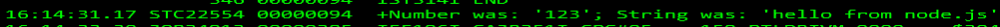

# Node.js Hello WTO on z/OS

This project demonstrates calling HLASM/Metal C from Node.js.  It is a work in progress (much could be cleaned up to make this process smoother).

```JavaScript
var addon = require('bindings')('wto');

console.log(addon.wto("hello from node.js", 123));
```



## Prereq

`npm install -g @zowe/cli`

## Profiles

`zowe profiles create zosmf ...`
`zowe profiles create uss ...`

## Scripts

Update `package.json` to replace `ibmuser` with your user and location preference.

## One Time Setup

`npm run setup` 
- allocate zfs
- mount 
- upload source
- configure `node-gyp`
- update `node-gyp` Makefile
- `make wtoexec.c` into `wtoexec.o`
- build the project

## Subsequent Changes & Builds

`npm run upload`
- upload source files

`npm run remote:build`
- invoke `make` and `node-gyp` build